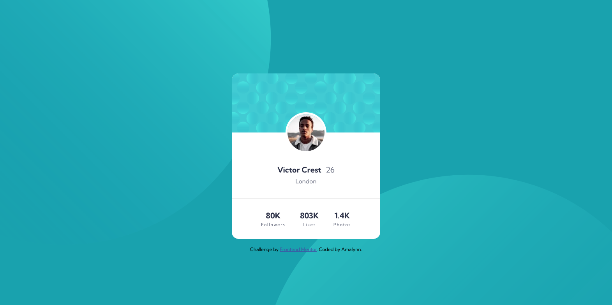

# Frontend Mentor - Profile card component solution

This is a solution to the [Profile card component challenge on Frontend Mentor](https://www.frontendmentor.io/challenges/profile-card-component-cfArpWshJ). Frontend Mentor challenges help you improve your coding skills by building realistic projects. 

## Table of contents

- [Overview](#overview)
  - [The challenge](#the-challenge)
  - [Screenshot](#screenshot)
  - [Links](#links)
- [My process](#my-process)
  - [Built with](#built-with)  -
  - [Useful resources](#useful-resources)
- [Author](#author)

## Overview

### The challenge

- Build out the project to the designs provided

### Screenshot

### Links

- Solution URL: [My GitHub solution here](https://github.com/Amalynn/fem-profile_card_component.git) 
- Live Site URL: [My live site here](https://amalynn.github.io/fem-profile_card_component/)

## My process

### Built with

- Semantic HTML5 markup
- CSS custom properties
- Flexbox
- CSS Grid
- Mobile-first workflow

### Useful resources

- [CSS Reset](https://www.joshwcomeau.com/css/custom-css-reset/) - Simple and efficient CSS Reset rules from Josh Comeau with a well-detailed description

## Author

- Frontend Mentor - [@Amalynn](https://www.frontendmentor.io/profile/Amalynn)

